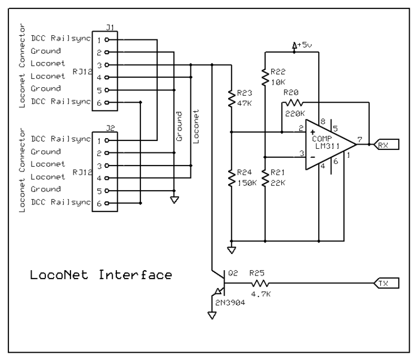

 El corazón de todo el montaje para el bus loconet se centra en la HTX003 que no es más ni menos, que una interfaz para conectar un arduino al bus loconet. Dicho arduino irá cargado con el programa específico en función del tipo de decoder que se desee simular, bien de entrada/salida, bien deco de servos, etc.

La placa está basada en el diseño esquemático de la MRRWA que junto con una librería específica hace posible dicha comunicación.

El diseño básico contiene la interfaz para un arduino UNO y para un arduino NANO. La alimentación la puede tomar tanto del propio bus loconet como de una fuente externa de 12V en corriente contínua. He puesto un estabilizador de tensión para reducir los 12V que entran por el bus loconet o por la fuente externa a los 5V que necesita el arduino para trabajar y el resto de componentes, así como lo que se le conecte de accesorio. La fuente está estabilizada y apenas genera calor, por lo que no hace falta disipador. Con esto conseguimos también que el regulador de 5V interno de arduino no trabaje y por consiguiente no se genere calor innecesario.

Pruebas para el reconocimiento de la placa en Rocrail

Para conectarlo al resto de componentes que le darán la "potencia" a estos montaje, le he puesto las correspondientes salidas en una serie de pines que se podrán configurar tanto de entrada como de salida.

Se le puede conectar una HTX002 o una GCA93 para detectar el paso de los trenes y tener retroseñalización en  RocRail o bien se puede conectar placas de mosfet o de relés para tener salidas para conectar luces.

La placa se conecta al bus de datos por medio de las clavijas RJ12.

En mi caso, lo conecto a la central DR5000 de Digikeijsal puerto Loconet T que es la que lleva alimentación de 12V en los pines 1 y 6. El Loconet B envía la señal DCC por esos mismos pines y está pensada para conectar un Booster que amplifique la señal DCC.

Para programar el arduino lo primero que tenemos que hacer es cargar la librería específica de Loconet que podéis descargar aquí. y lo haremos de la siguiente manera:

## PROGRAMANDO ARDUINO

Primero nos vamos a la opción de menú PROGRAMA > INCLUIR LIBRERÍA > AÑADIR 

Buscamos el archivo que nos hemos descargado antes y lo abrimos:

Para comprobar que se ha cargado correctamente lo podemos mirar en  PROGRAMA > INCLUIR LIBRERÍA > LOCONET

Ahora pasamos a cargar el programa de arduino. El programa (o sketch) lo ha realizado Daniel Guisado y podéis seguirlo en su magnífico blog del Club N Caldes. Sin su inestimable esfuerzo y dedicación, todo esto no se habría logrado. Gracias.

Abrimos el archivo .ino y configuramos la placa que vamos a usar entrando en HERRAMIENTAS > PLACA > ARDUINO UNO

A continuación seleccionamos el puerto COM que nos habrá creado el PC al conectar la placa por USB. Nos vamos a HERRAMIENTAS > PUERTO > COMx (siendo x el número de puerto que nos da el PC)

Por último seleccionamos el programador que usará el entorno para cargar nuestro programa a la placa. Entramos en HERRAMIENTAS > PROGRAMADOR > AVRISP mkII (este es el que me ha usado a mi por defecto)

Para finalizar procedemos a compilar y subir el programa a la placa.

## CONFIGURANDO HTX003 EN ROCRAIL

Lo primero es "buscar"  la placa que queremos configurar de entre todas las que puede haber instaladas. Para ello nos vamos PROGRAMAR > GCA > GCA50

Esto nos abre una nueva ventada que tiene varias pestañas donde se configura la placa como entrada, salida o ambas cosas a la vez. Para localizar la placa a programar nos vamos a la pestaña "ADDRESSES" y a continuación pulsamos en el botón "QUERTY"

Esto hará que en esa misma pantalla se nos listen todos los dispositivos compatibles con la GCA50. Recordar que el programa que ha hecho Dani Guisado no es más que reproducir el funcionamiento de dicha placa pero vía software, por eso se configura exactamente igual que esta placa.

Una vez se nos listen todas, seleccionamos la que queramos programar. Las placas vienen por defecto con un valor LOW de 81 y un valor SUB de 1. Bastará con modificar dichos valores a los que queramos y pulsar el botón SET

